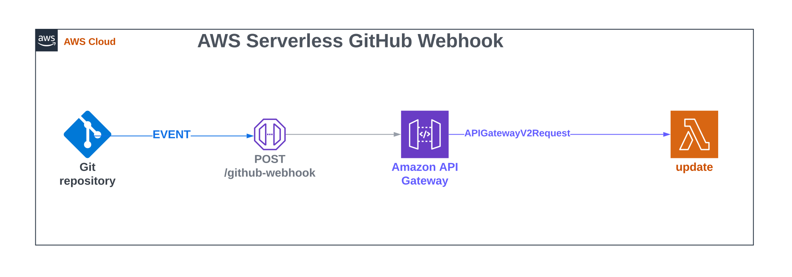

# Breeze - GenerateGithubWebook

The `breeze` package subcommand `generate-github-webook` provides the code to build a Serverless GitHub Webhook in Swift based on AWS Lambda and APIGateway.

## Abstract

> Webhooks can let your integrations take an action in response to events that occur on GitHub.

See official documentation about [GitHub Webhooks](https://docs.github.com/en/webhooks).



The generated template exposes a webhook to GitHub through the API Gateway, the lambda implements the logic to validate, decode and perform an action based on the received GitHub event. 
The lambda supports the `sha256` signature verification as described on the official documentation [validating-webhook-deliveries](https://docs.github.com/en/webhooks/using-webhooks/validating-webhook-deliveries)

## The command line tool

```bash
swift run breeze generate-github-webhook --help
```

output:

```bash
USAGE: breeze generate-github-webhook --config-file <config-file> --target-path <target-path> [--force-overwrite] [-y]

OPTIONS:
  -c, --config-file <config-file>
                          YML configurarion file
  -t, --target-path <target-path>
                          Target path
  -f, --force-overwrite   Force target path overwrite
  -y
  -h, --help              Show help information.
```

## Configuration file

Define a configuration file with the following format:
```yml
service: swift-breeze-github-webhook
awsRegion: us-east-1
swiftVersion: 5.10.1
swiftConfiguration: release
packageName: BreezeGitHubWebHook
buildPath: build
cors: false
breezeGithubWebhook:
    targetName: GitHubWebHook
    httpPath: /github-webhook
    secret: ${ssm:/dev/swift-webhook/webhook_secret}
```

Configuration parameters:
- `awsRegion`: AWS Region
- `swiftVersion`: Swift version
- `swiftConfiguration`: Swift configuration (debug or release)
- `packageName`: Swift Package name
- `buildPath`: Swift Package build path where the Lambda executable will be generated
- `cors`: Enable CORS (default: false)
- `breezeGithubWebhook`: Breeze GitHub Webhook configuration
    - `targetName`: The name of the target that will be generated by the Swift Package Manager
    - `httpPath`: The path of the API
    - `secret`: The `sha256` secret generated on GitHub. 
    
### Using System Manager to store GitHub Secret
The `sha256` secret can be securely stored on AWS using `System Manager` -> `Parameter Store`. The secret must be stored before deploying the project. In the example the `${ssm:/dev/swift-webhook/webhook_secret}` instructs Serverless framework to look for the value on the path `/dev/swift-webhook/webhook_secret`.

## Lambda customisation

Open the generated code, decode the GitHub payload and implement your custom business logic.

```swift
func handle(context: AWSLambdaRuntimeCore.LambdaContext, event: AWSLambdaEvents.APIGatewayV2Request) async -> AWSLambdaEvents.APIGatewayV2Response {
        do {
            context.logger.info("event: \(event)")
            let payload = try validateGitHubSignature(context: context, event: event)
            
            // TODO: Decode the Github payload
            
            // TODO: Implement the business logic
            
            return APIGatewayV2Response(with: "{}", statusCode: .ok)
        } catch {
            return APIGatewayV2Response(with: error, statusCode: .badRequest)
        }
    }
```