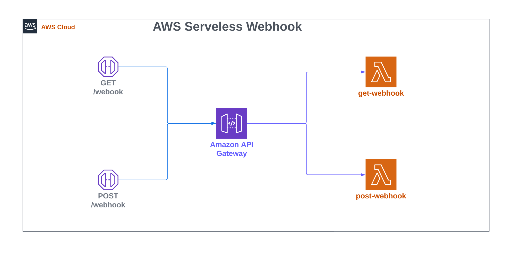

# Breeze - GenerateWebook

The `breeze` package subcommand `generate-webook` provides the code to build a Serverless a GET/POST Webhook in Swift based on AWS Lambda and APIGateway.

## Abstract



The generated template exposes a GET/POST webhook to the internet using the API Gateway. The lambdas implement the logic to retrieve data from GitHub using GET and POST.

## The command line tool

```bash
swift run breeze generate-webhook --help
```

output:

```bash
USAGE: breeze generate-webhook --config-file <config-file> --target-path <target-path> [--force-overwrite] [-y]

OPTIONS:
  -c, --config-file <config-file>
                          YML configurarion file
  -t, --target-path <target-path>
                          Target path
  -f, --force-overwrite   Force target path overwrite
  -y
  -h, --help              Show help information.
```

## Configuration file

Define a configuration file with the following format:
```yml
service: swift-breeze-webhook
awsRegion: us-east-1
swiftVersion: 5.10.1
swiftConfiguration: release
packageName: BreezeWebHook
buildPath: build
cors: false
breezeWebhook:
    targetName: WebHook
    httpPath: /webhook
```

Configuration parameters:
- `awsRegion`: AWS Region
- `swiftVersion`: Swift version
- `swiftConfiguration`: Swift configuration (debug or release)
- `packageName`: Swift Package name
- `buildPath`: Swift Package build path where the Lambda executable will be generated
- `cors`: Enable CORS (default: false)
- `breezeGithubWebhook`: Breeze GitHub Webhook configuration
    - `targetName`: The name of the target that will be generated by the Swift Package Manager
    - `httpPath`: The path of the API

## Lambda customisation

Open the generated code, and implement your custom business logic by changing the default implementation of `GetWebHook` and `PostWebHook`.

### GetWebHook default implementation

If the parameter `github-user` is present in the URL query string, the value is extracted and used to get the content from GitHub, the content is returned to the response payload.

```swift
import Foundation
import BreezeLambdaWebHook
import AsyncHTTPClient
import AWSLambdaEvents
import AWSLambdaRuntime

final class GetWebHook: BreezeLambdaWebHookHandler {
    
    let handlerContext: HandlerContext
    
    required init(handlerContext: HandlerContext) {
        self.handlerContext = handlerContext
    }
    
    func handle(_ event: APIGatewayV2Request, context: LambdaContext) async -> APIGatewayV2Response {
        do {
            context.logger.info("event: \(event)")
            guard let params = event.queryStringParameters else {
                throw BreezeLambdaWebHookError.invalidRequest
            }
            if let user = params["github-user"] {
                let url = "https://github.com/\(user)"
                let request = HTTPClientRequest(url: url)
                let response = try await httpClient.execute(request, timeout: .seconds(3))
                let bytes = try await response.body.collect(upTo: 1024 * 1024) // 1 MB Buffer
                let body = String(buffer: bytes)
                return APIGatewayV2Response(with: body, statusCode: .ok)
            } else {
                return APIGatewayV2Response(with: params, statusCode: .ok)
            }
        } catch {
            return APIGatewayV2Response(with: error, statusCode: .badRequest)
        }
    }
}
```

### PostWebHook default implementation

If the parameter `github-user` is present in the JSON payload, the value is extracted and used to get the content from GitHub, the content is returned to the response payload.

```swift
import Foundation
import AsyncHTTPClient
import AWSLambdaEvents
import AWSLambdaRuntime
import BreezeLambdaWebHook

enum PostWebHookError: Error {
    case invalidBody
}

struct PostWebHookRequest: Codable {
    let githubUser: String
    
    enum CodingKeys: String, CodingKey {
        case githubUser = "github-user"
    }
}

final class PostWebHook: BreezeLambdaWebHookHandler {
    
    let handlerContext: HandlerContext
    
    required init(handlerContext: HandlerContext) {
        self.handlerContext = handlerContext
    }
    
    func handle(_ event: APIGatewayV2Request, context: LambdaContext) async -> APIGatewayV2Response {
        do {
            context.logger.info("event: \(event)")
            let incomingRequest: PostWebHookRequest = try event.bodyObject()
            let url = "https://github.com/\(incomingRequest.githubUser)"
            let request = HTTPClientRequest(url: url)
            let response = try await httpClient.execute(request, timeout: .seconds(3))
            let bytes = try await response.body.collect(upTo: 1024 * 1024) // 1 MB Buffer
            let body = String(buffer: bytes)
            return APIGatewayV2Response(with: body, statusCode: .ok)
        } catch {
            return APIGatewayV2Response(with: error, statusCode: .badRequest)
        }
    }
}
```