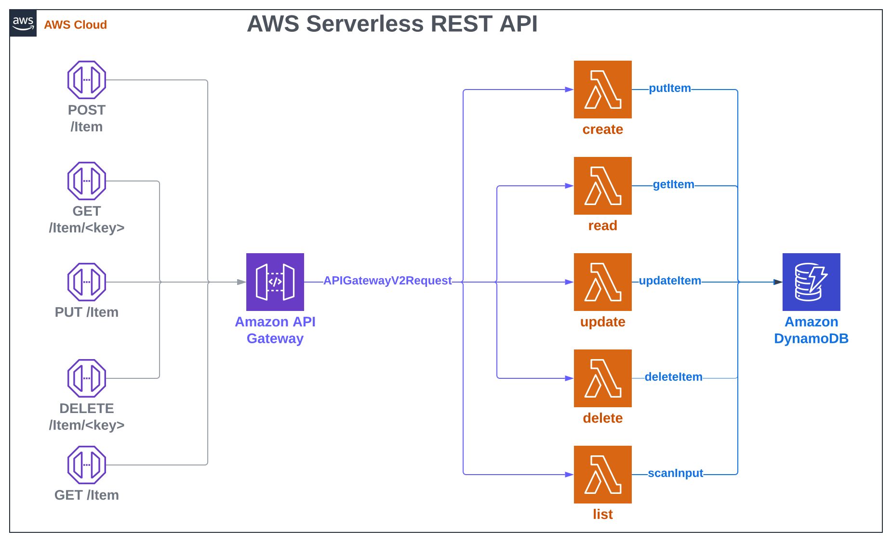

# Breeze
[](https://swiftpackageindex.com/swift-sprinter/Breeze) [](https://swiftpackageindex.com/swift-sprinter/Breeze)  [](https://codecov.io/gh/swift-sprinter/Breeze)


Serverless API using AWS APIGateway, Lambda, and DynamoDB in Swift is like a breeze!

## Abstract

This package provides the code to build a Serverless REST API in Swift based on AWS Lambda, APIGateway and DynamoDB.

The following diagram represents the infrastructure architecture of a CRUD REST Serverless API:



The APIGateway exposes the API interface through endpoints and converts the HTTP requests to APIGatewayV2Request events for the Lambdas.
Each Lambda receives events from the APIGateway, decodes the events to extract parameters, operates on a DynamoDB table and returns a response payload to the APIGateway. DynamoDB will be accessed through the Lambdas to persist a key-value pair representing data. 

With a single line of code, Breeze implements all the Lambdas required for the CRUD interface converting APIGatewayV2Request to an operation on a DynamoDB table and responding with APIGatewayV2Response to the APIGateway.

# Usage

## Lambda customisation

Define a `Codable` struct or class like the `Item` one's in the example and pass it to `BreezeLambdaAPI` using the type placeholder.

```swift
import Foundation
import BreezeLambdaAPI
import BreezeDynamoDBService

struct Item: Codable {
    public var key: String
    public let name: String
    public let description: String
    public var createdAt: String?
    public var updatedAt: String?
    
    enum CodingKeys: String, CodingKey {
        case key
        case name
        case description
        case createdAt
        case updatedAt
    }
}

extension Item: BreezeCodable { }

BreezeLambdaAPI<Item>.main()
```

It's required the `Codable` struct or class to conform to the `BreezeCodable` protocol:

```swift
public protocol BreezeCodable: Codable {
    var key: String { get set }
    var createdAt: String? { get set }
    var updatedAt: String? { get set }
}
```

The code above is the business logic required inside all the Lambdas.
All you need to do is to decide the struct conforming `BreezeCodable` to persist on DynamoDB.

Each lambda will be initialized with a specific `_HANDLER` and it will run the code to implement the required logic needed by one of the CRUD functions. The code needs to be packaged and deployed using the referenced architecture.

## Lambda package with Swift Package Manager

To package the Lambda is required to create a Swift Package using the following `Package.swift` file.

```swift
// swift-tools-version:5.7
// The swift-tools-version declares the minimum version of Swift required to build this package.

import PackageDescription

let package = Package(
    name: "swift-breeze-item-api",
    platforms: [
        .macOS(.v13),
    ],
    products: [
        .executable(name: "ItemAPI", targets: ["ItemAPI"]),
    ],
    dependencies: [
        .package(url: "https://github.com/swift-sprinter/Breeze.git", from: "0.1.0"),
    ],
    targets: [
        .executableTarget(
            name: "ItemAPI",
             dependencies: [
                .product(name: "BreezeLambdaAPI", package: "Breeze"),
                .product(name: "BreezeDynamoDBService", package: "Breeze"),
            ]
        )
    ]
)

```

To be executed on a Lambda, the package needs to be built on `AmazonLinux2` and deployed.

# Deployment Example

The API can be deployed on AWS in multiple ways.

Refer to the [Example](Example) folder to explore a deployment example using the Serverless Framework.

# Implementation Specs

## Lambda initialization

During the Lambda's initialization, the `BreezeLambdaAPI` reads the configuration from the following `Environment` variables:
- `AWS_REGION`: AWS Region
- `_HANDLER`: The handler name specifies the CRUD operation implemented by the Lambda using the following format `{executable_name}.{BreezeOperation}` or `{BreezeOperation}`

```swift
enum BreezeOperation: String {
    case create
    case read
    case update
    case delete
    case list
}
```
(example: `build/RestAPI.create` where `build/RestAPI` is the executable name and `create` is the BreezeOperation).
- `DYNAMO_DB_TABLE_NAME`: DynamoDB table name.
- `DYNAMO_DB_KEY`: DynamoDB Primary Key

## APIGateway Requests and Responses

`BreezeLambdaAPI` receives an APIGateway event, extracts the relevant parameters and performs a `BreezeOperation` on `BreezeDynamoDBService`.

- `create`

Decodes a `BreezeCodable` from the `APIGatewayV2Request.body` and calls `createItem` on `BreezeDynamoDBService`.
Returns the created `BreezeCodable`.

- `read`

Gets the value of the `BreezeCodable.key` from the `APIGatewayV2Request.pathParameters` dictionary and calls `readItem` on `BreezeDynamoDBService`.
Returns the `BreezeCodable` if persisted on DynamoDB.

- `update`

Decodes a `BreezeCodable` from the `APIGatewayV2Request.body` and calls `updateItem` on `BreezeDynamoDBService`.
Returns the updated `BreezeCodable`.

- `delete`

Gets the value of the `BreezeCodable.key` from the `APIGatewayV2Request.pathParameters` dictionary and calls `deleteItem` on `BreezeDynamoDBService`.
Returns the `BreezeCodable` if persisted on DynamoDB.

- `list`

Gets the value of the `exclusiveStartKey` and `limit` from the `APIGatewayV2Request.pathParameters` dictionary and calls `listItems` on `BreezeDynamoDBService`.
Returns the `ListResponse` containing the items if persisted on DynamoDB.

```swift
struct ListResponse<T: Codable>: Codable {
    let items: [T]
    let lastEvaluatedKey: String?
}
```

 (See SotoDynamoDB documentation for more info [*](https://soto.codes/reference/DynamoDB.html))
